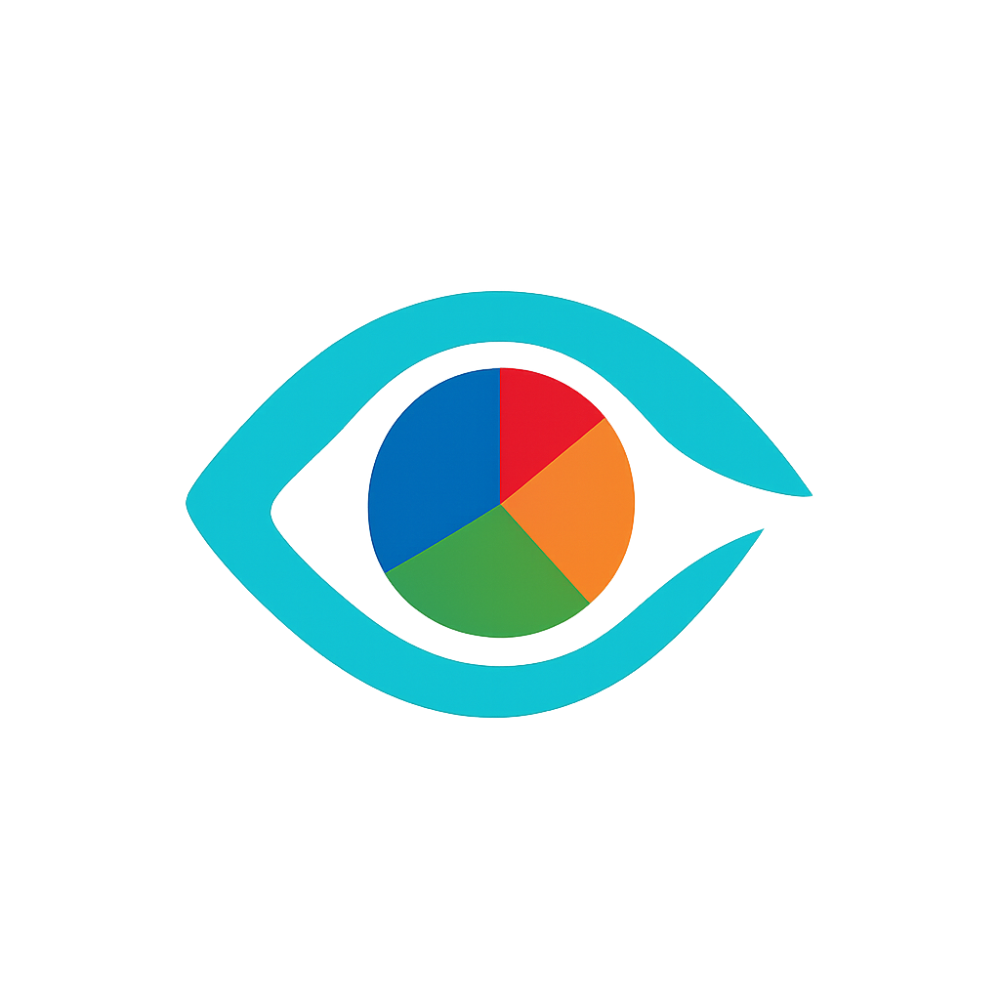

# 🛍️ Revela - AI-Powered Product Scanner

<div align="center">



**Scan. Analyze. Make Informed Choices.**

[](https://flutter.dev)
[](https://dart.dev)
[](https://m3.material.io)
[](LICENSE)

</div>

---

## 🌟 Overview

**Revela** is a cutting-edge Flutter application that leverages advanced AI technology to analyze food products, beverages, and consumables. Simply snap a photo or upload an image, and Revela provides instant, comprehensive health insights including ingredient analysis, toxicity alerts, and healthier alternatives.

### ✨ Key Highlights

- 🤖 **AI-Powered Analysis** - Advanced vision AI for accurate product recognition
- 🏥 **Health Scoring** - 0-100 health rating with detailed explanations
- ⚠️ **Toxicity Detection** - Identifies harmful ingredients and health concerns
- 💡 **Smart Alternatives** - Suggests better, healthier product options
- 🎨 **Material 3 Design** - Modern, expressive UI with dynamic theming
- 🌓 **Adaptive Themes** - Light, Dark, and System-based theme modes
- 📱 **Cross-Platform** - Works on Android, iOS, and more
- 🔒 **Privacy-Focused** - All analysis happens securely
- 🚀 **Fast & Efficient** - Optimized for performance with caching

---

## 📱 Features

### Core Functionality

#### 1. **Instant Product Analysis**
- Camera integration for real-time scanning
- Gallery support for uploaded images
- Automatic product recognition
- Non-food item detection and rejection

#### 2. **Comprehensive Health Insights**
- **Health Score (0-100)**: Quantitative health rating
- **Ingredient Breakdown**: Top 5-8 key ingredients analyzed
- **AI Explanation**: 2-3 sentence summary of health concerns
- **Toxicity Alerts**: Up to 3 critical health warnings
- **Better Alternatives**: Up to 3 healthier product suggestions

#### 3. **Smart Sharing**
- AI-generated shareable summaries
- Includes key insights, ingredients, and alternatives
- Formatted for social media and messaging apps
- Engaging emoji-rich content

#### 4. **Beautiful UI/UX**
- Material 3 Design System
- Expressive loading indicators
- Smooth animations and transitions
- Responsive design with ScreenUtil
- Dynamic color schemes
- Glassmorphic effects

#### 5. **Theme Management**
- Light Mode
- Dark Mode
- System Auto (follows device settings)
- Theme persistence with SharedPreferences
- Seamless theme switching

---

## 🛠️ Technology Stack

### Frontend
- **Flutter 3.5.4** - Cross-platform framework
- **Dart 3.5.4** - Programming language
- **Material 3** - Design system

### Key Packages
```yaml
dependencies:
  flutter_screenutil: ^5.9.3          # Responsive UI
  provider: ^6.1.1                     # State management
  dynamic_color: ^1.7.0                # Material You theming
  image_picker: ^1.0.7                 # Camera/Gallery access
  http: ^1.2.0                         # API communication
  shared_preferences: ^2.2.2           # Local storage
  share_plus: ^7.2.2                   # Native sharing
  expressive_loading_indicator: ^0.0.1 # Modern loaders
```

### AI & Backend
- **Pollinations AI** - Vision and text analysis
- **OpenFoodFacts API** - Product database (optional)
- Real-time image analysis with base64 encoding
- JSON-based AI responses

---

## 🚀 Getting Started

### Prerequisites

- Flutter SDK (3.5.4 or higher)
- Dart SDK (3.5.4 or higher)
- Android Studio / VS Code
- Physical device or emulator

### Installation

1. **Clone the repository**
   ```bash
   git clone https://github.com/yourusername/revela.git
   cd revela
   ```

2. **Install dependencies**
   ```bash
   flutter pub get
   ```

3. **Add app logo**
   - Place your logo image at `assets/images/logo.png`
   - Update `pubspec.yaml` if needed

4. **Run the app**
   ```bash
   flutter run
   ```

### Build for Production

**Android:**
```bash
flutter build apk --release
```

**iOS:**
```bash
flutter build ios --release
```

---

## 📖 How to Use

### 1. **Launch the App**
   - Beautiful splash screen with animated logo
   - Smooth transition to home screen

### 2. **Scan a Product**
   - Tap **Camera** icon to take a photo
   - Tap **Gallery** icon to upload an image
   - Wait for AI analysis (animated loading indicator)

### 3. **View Results**
   - **Health Score**: Visual circular indicator with rating
   - **Product Name**: Identified product with shopping bag icon
   - **Quick Stats**: Ingredient count, alerts, and alternatives
   - **Ingredients List**: Numbered breakdown of key components
   - **AI Analysis**: Expert insights on health impact
   - **Toxicity Alerts**: Warning cards for harmful substances
   - **Better Alternatives**: Recommended healthier options

### 4. **Share Results**
   - Tap the **Share** button in the app bar
   - AI generates a comprehensive summary
   - Share via any installed app (WhatsApp, SMS, Email, etc.)

### 5. **Customize Theme**
   - Go to **Settings** (gear icon)
   - Choose Light, Dark, or System theme
   - Changes apply instantly and persist across sessions

---

## 🎨 App Architecture

### Project Structure
```
lib/
├── main.dart                    # App entry point
├── models/
│   └── product_model.dart       # Data model
├── screens/
│   ├── splash_screen.dart       # Animated splash
│   ├── home_screen.dart         # Main scanning UI
│   ├── product_details_screen.dart  # Results display
│   └── settings_screen.dart     # Theme & app info
└── services/
    ├── api_service.dart         # AI & API logic
    └── theme_manager.dart       # Theme state management
```

### Key Design Patterns
- **Provider Pattern** - State management
- **Repository Pattern** - API abstraction
- **MVVM Architecture** - Separation of concerns
- **Singleton Services** - Efficient resource usage

---

## 🔒 Privacy & Security

- ✅ **No User Data Collection** - Images are not stored
- ✅ **Secure API Communication** - HTTPS only
- ✅ **Local Theme Storage** - SharedPreferences for settings
- ✅ **No Third-Party Tracking** - Privacy-focused design
- ✅ **File Validation** - Size and format checks
- ✅ **Error Handling** - Comprehensive exception management

---

## 🌐 API Integration

### AI Analysis Flow
1. **Image Capture** → User takes/selects photo
2. **Validation** → File size and format check
3. **Base64 Encoding** → Convert image to base64
4. **AI Request** → Send to Pollinations AI
5. **Response Parsing** → Extract JSON from markdown
6. **Data Validation** → Clean and limit data
7. **UI Display** → Show results with animations

### Error Handling
- Network errors (no internet)
- Timeout errors (60s limit)
- Invalid image formats
- Non-food product detection
- API rate limiting (429)
- Server errors (500+)
- File size limits (10MB max)

---

## 🎯 Future Enhancements

### Planned Features
- [ ] **Barcode Scanner** - Quick product lookup
- [ ] **History & Favorites** - Save scanned products
- [ ] **Offline Mode** - Basic analysis without internet
- [ ] **Multi-Language Support** - Internationalization
- [ ] **Nutritional Info** - Calories, macros, vitamins
- [ ] **Allergen Detection** - Personal allergen warnings
- [ ] **Product Comparison** - Side-by-side analysis
- [ ] **Cloud Sync** - Cross-device history
- [ ] **AR Mode** - Augmented reality scanning
- [ ] **Community Reviews** - User-generated insights

---

## 🤝 Contributing

We welcome contributions! Please follow these steps:

1. Fork the repository
2. Create your feature branch (`git checkout -b feature/AmazingFeature`)
3. Commit your changes (`git commit -m 'Add some AmazingFeature'`)
4. Push to the branch (`git push origin feature/AmazingFeature`)
5. Open a Pull Request

### Development Guidelines
- Follow Flutter/Dart style guide
- Write meaningful commit messages
- Add comments for complex logic
- Test on multiple devices
- Update README for new features

---

## 📄 License

This project is licensed under the MIT License - see the [LICENSE](LICENSE) file for details.

---

## 👥 Authors

**Your Name**
- GitHub: [@yourusername](https://github.com/yourusername)
- Email: your.email@example.com

---

## 🙏 Acknowledgments

- [Flutter Team](https://flutter.dev) - Amazing framework
- [Material Design](https://m3.material.io) - Design system
- [Pollinations AI](https://pollinations.ai) - AI API
- [OpenFoodFacts](https://world.openfoodfacts.org) - Product database
- All open-source contributors

---

## 📞 Support

If you encounter any issues or have questions:

- 🐛 [Report a Bug](https://github.com/yourusername/revela/issues)
- 💡 [Request a Feature](https://github.com/yourusername/revela/issues)
- 📧 [Email Support](mailto:support@revela.app)

---

<div align="center">

**Made with ❤️ using Flutter**

⭐ Star this repo if you like it!

</div>
